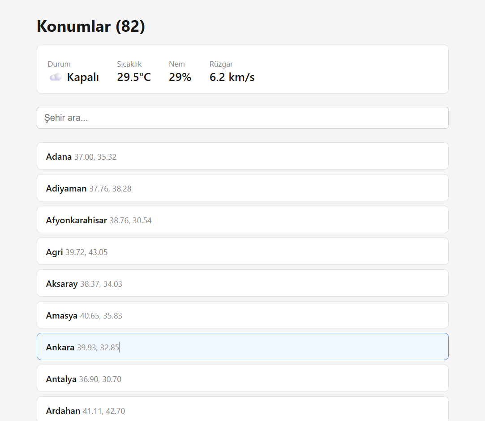
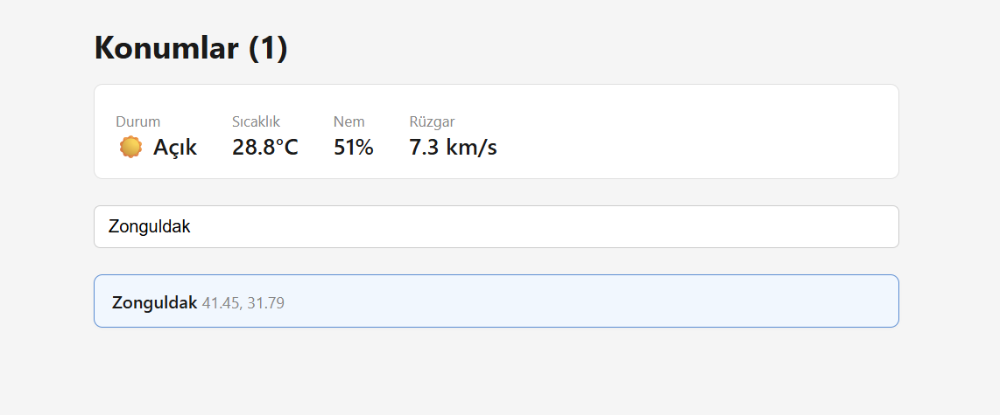
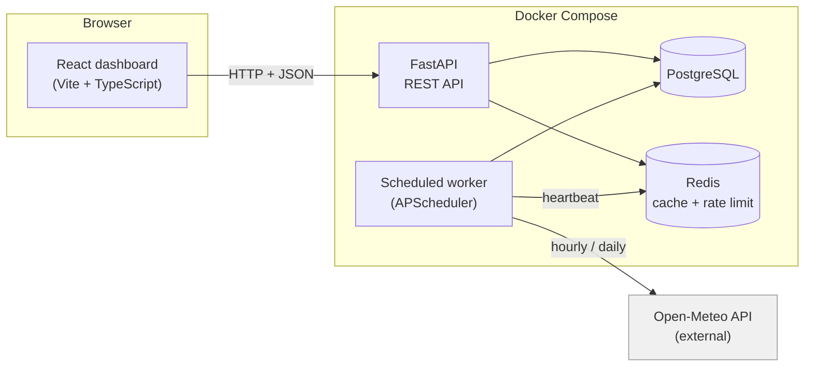

# weather-service

A production-style weather data service for the 81 provinces of Turkey. It
collects forecasts and observations from [Open-Meteo](https://open-meteo.com),
stores both, and then **scores the forecasts against what actually
happened** — turning "tomorrow will be 28°C" into "our 3-day forecasts miss
by 8°C on average."

A FastAPI backend, a scheduled collection worker, and a React dashboard,
all containerized. **115 tests**, all green.

<!-- Replace with your own screenshot; see docs/screenshots/README below -->



---

## Why this exists

Most weather apps show you a forecast and forget it. This one keeps score.
Every forecast is stored the moment it is issued, every observation is
stored when it arrives, and the two are matched up afterwards by location
and hour. That makes it possible to answer the question forecasters
actually care about: **how good were the predictions?**

The headline finding falls straight out of the data — accuracy decays with
lead time:

```
 6h ahead  ->  MAE 1.0 °C
24h ahead  ->  MAE 3.0 °C
72h ahead  ->  MAE 8.0 °C
```

Three error measures are computed, because each answers a different
question: **MAE** (average miss), **RMSE** (which punishes large misses
harder), and **bias** (whether the forecast leans systematically warm or
cold — the part a forecaster could actually correct for).

## Architecture



Four containers, one image. The API and the worker share a codebase but
run as **separate processes** on purpose: a slow data fetch across 81
cities should never make an HTTP request wait, and the two need to fail
and scale independently. One city's failed fetch is isolated — it is
counted, not fatal, so a run that touches 81 cities and fails on 2 still
stores the other 79.

## Quick start

```bash
docker compose up --build
```

Then:

- **Dashboard:** http://localhost:5173 (run the frontend — see below)
- **API docs:** http://localhost:8000/docs
- **Health:** http://localhost:8000/health/ready

Pull data immediately instead of waiting for the schedule:

```bash
docker compose exec worker python -m weather.workers.main --once
```

### Frontend

The dashboard is a Vite + React + TypeScript app in `frontend/`:

```bash
cd frontend
npm install
npm run dev
```

It reads the API base URL from `frontend/.env` (`VITE_API_URL`); copy
`frontend/.env.example` to get started.

## Features

- **Collection worker** — fetches observations hourly and forecasts daily,
  on a schedule, with per-location fault isolation and idempotent upserts
  (re-running never duplicates data).
- **Forecast accuracy** — matches forecasts to observations by target
  hour, computes MAE / RMSE / bias, and breaks error down by lead time.
- **REST API** — paginated reads, API-key auth on writes, Redis-backed
  rate limiting and response caching, all fail-open so a cache outage
  degrades rather than breaks the service.
- **Observability** — every request carries a correlation id and leaves
  one structured log line; the worker records a heartbeat surfaced at
  `/status`.
- **Dashboard** — searchable list of all provinces; click a city to see
  its current conditions, including a WMO weather code rendered as an
  icon and label.

## Endpoints

Full interactive docs at `/docs`. Reads are open; writes (POST/DELETE)
require an `X-API-Key` header when `API_KEYS` is configured.

| Method | Path | What |
|---|---|---|
| GET | `/locations` | list active locations (`?active_only=false` for all) |
| POST | `/locations` | add a location (409 if the coordinates exist) |
| GET | `/locations/{id}` | one location |
| DELETE | `/locations/{id}` | deactivate (keeps history, stops collection) |
| GET | `/locations/{id}/current` | most recent observation |
| GET | `/locations/{id}/observations` | history, paginated, date-filterable |
| GET | `/locations/{id}/forecasts` | forecasts (`?latest_only=false` for all) |
| GET | `/accuracy/summary` | MAE, RMSE, bias (`?location_id=`, `?max_horizon=`) |
| GET | `/accuracy/by-horizon` | error broken down by forecast lead time |
| GET | `/status` | service info and the worker's last run |

## Tech stack

**Backend:** Python 3.12, FastAPI, SQLAlchemy (async), PostgreSQL, Redis,
APScheduler, Alembic, httpx, structlog, Pydantic.
**Frontend:** React, TypeScript, Vite.
**Tooling:** Docker Compose, uv, pytest, Ruff, ESLint.

## Development

Backend:

```bash
uv sync
uv run pytest --cov=weather
uv run ruff check . && uv run ruff format .
```

Frontend:

```bash
cd frontend
npm run lint
```

Running the API outside Docker needs a `.env` (copy `.env.example`),
because the hostnames `db` and `cache` only exist inside the compose
network. Database schema changes are managed with Alembic:

```bash
docker compose exec api alembic upgrade head
```

## Project layout

```
src/weather/
├── api/         FastAPI app, routers, auth, rate limiting, caching
├── clients/     Open-Meteo client, response parsing, ingest
├── core/        config, logging, accuracy metrics (pure functions)
├── db/          models, migrations-backed schema, queries, accuracy
└── workers/     scheduler, collection jobs, heartbeat
frontend/src/    React dashboard (components, types, API calls)
tests/           115 tests against real Postgres and Redis
```

## License

MIT
